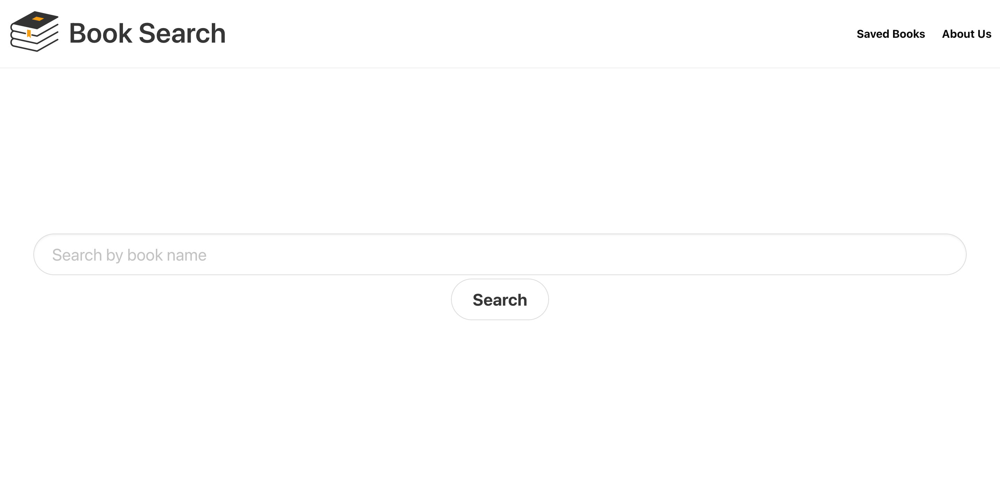

# Book Search Project

In this group-based project, we have used HTML as our baseline layout with Bulma CSS framework. We made it user interactive for the user to search a book and then select the desired book with the help of 2 server-side Api, one decidated for the book name search and the other for the description and rating of the book. We have also used Javascript to code function to help user navigate smoothly through the webpage. There's an option to save a book which saves it onto the local storage of the user for them to come back to.

Below is the screenshot of the webpage and The live link to the website: https://mohamedisaaq0.github.io/group-project-1/

